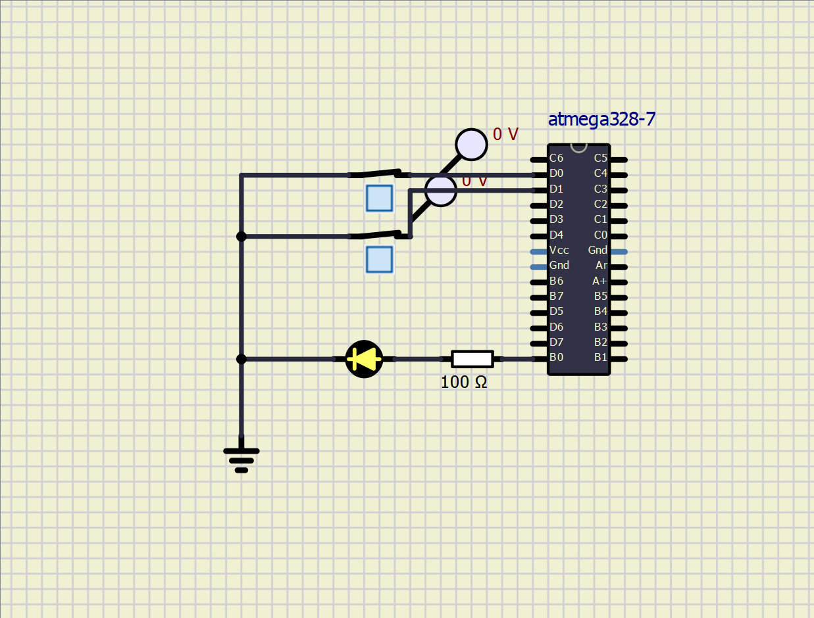
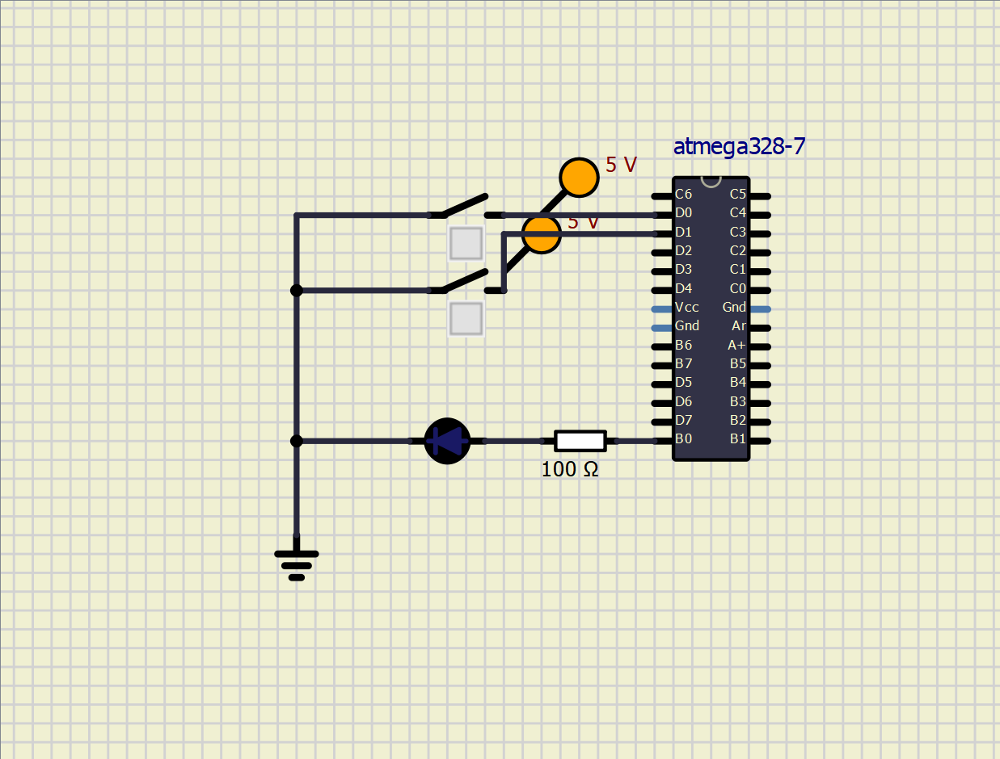
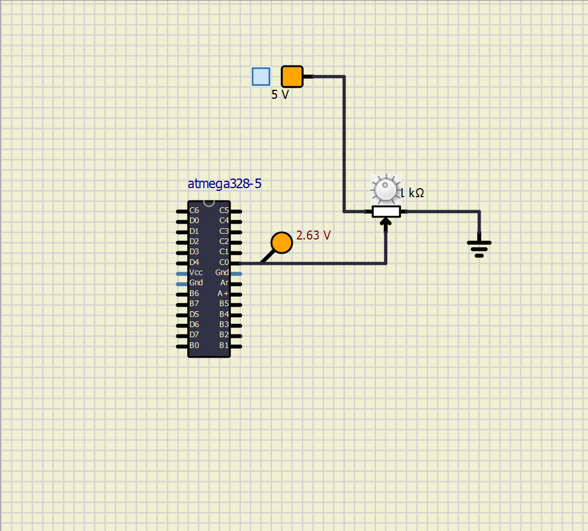
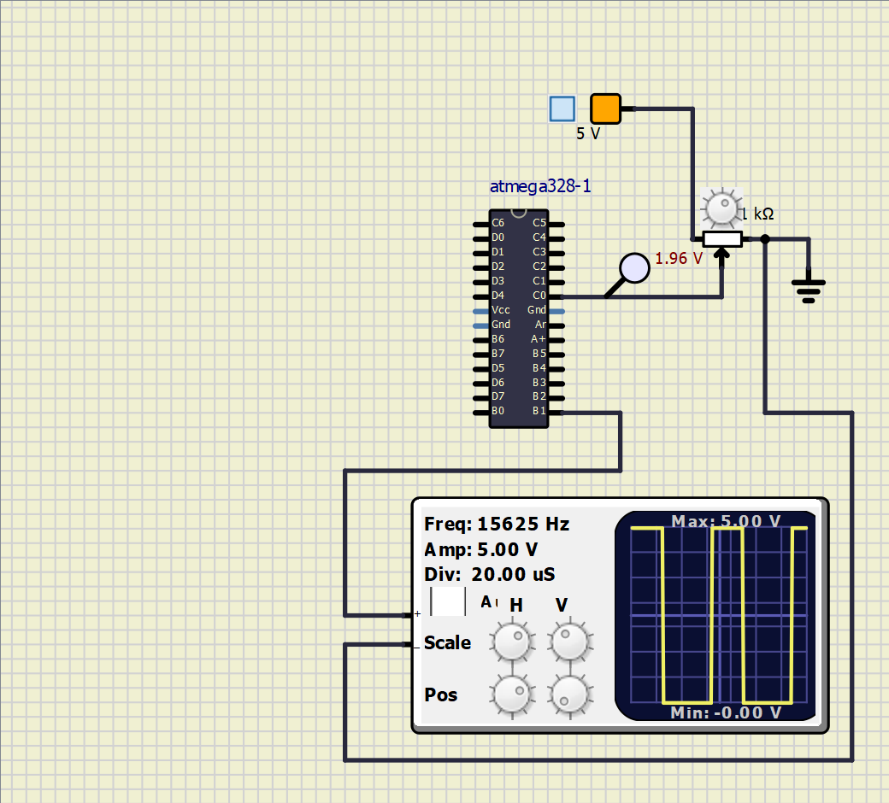

# Seat Heater Project In Action

### Activity 1 
#### 	Turn on LED when button sensor and heater are turned on
|ON|OFF|
|:--:|:--:|
|||

### Activity 2
#### Read values from potentiometer and convert to digital values

### Activity 3
#### Generate PWM signals based on required duty cycle

#### Activity 4
#### Print the corresponding value of temperature for the signal in serial monitor using USART

